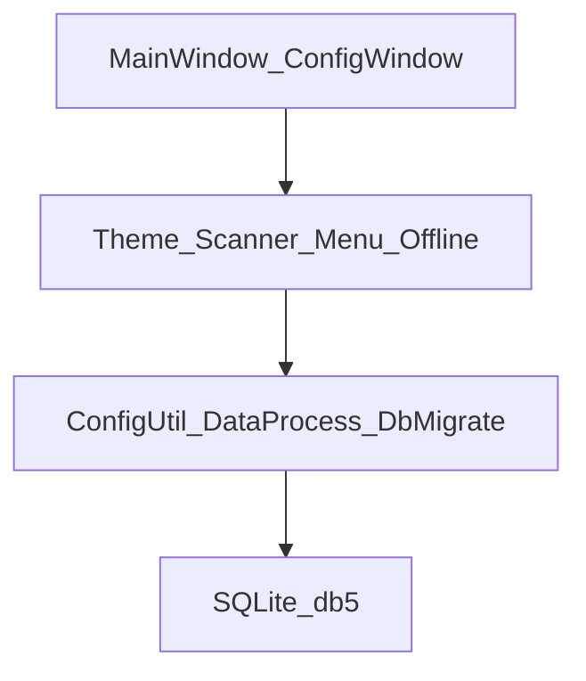

# Read133 设计开发总纲

本文档是本仓库设计与开发的**唯一总纲**。专题文档（便携、章节 TOC、结构债清单）服从本总纲。

## 1. 产品定位

纯净单机本地阅读器（txt / epub / mobi），产品名「单行阅读器」：

- **已删除**登录 / 注册 / 会员 / 支付 / 应用中心 / 网页抓取（窗体与引擎已物理删除）
- 数据与阅读进度保存在程序目录（整夹搬家可续读）；启动续读；约 **30s** 自动存进度
- 书架、最近阅读、目录、书签、主题与字号行距、编码重载、听书、**本章**预览与点行跳转
- **AI 助手**：DeepSeek 官方 API，双行隐蔽聊天 + 联网搜索 + **XAML 设置页**与人设预设（见 `ai-assistant.md`）

目标：源码结构规范，后续可在同一管道上扩展，禁止再外挂平行入口。

## 2. 技术栈决策

| 项 | 选择 |
|----|------|
| UI | WPF（兼少量 WinForms） |
| 运行时 | .NET Framework 4.7.2，x86 |
| 数据 | SQLite（`db5.data`，exe 同目录） |
| 依赖 | `libs/` 下 EpubSharp、Newtonsoft.Json、System.Data.SQLite 等 |

**不换栈**（.NET 8 / Avalonia / WinUI）：产品仍为 WPF net472；界面已恢复为可编辑 XAML 源并由 MSBuild 编译。换栈≈重写产品，当前不实施。

## 3. 现状与原则

反编译主体 + 早期 fork 补丁导致：`MainWindow` 过重、菜单运行时 Insert、主题与 `ConfigWindow` 双入口、配置/Schema 双轨。

**原则**

1. 融入原管道：`ConfigUtil` / `ConfigWindow` / `DataProcess` / `JumpChapterWindow`
2. 禁止平行设置写入与平行进度库
3. 新逻辑进 `Read133.Utils` 服务类；`MainWindow` 只接线
4. Schema 变更只走 `DbMigrate`
5. 文档与代码同提交

## 4. 模块职责

| 模块 | 职责 |
|------|------|
| `PortablePath` | 相对路径、PathMd5、ContentMd5 |
| `DbMigrate` | 便携库拷贝、缺列补齐、书签表 |
| `BookLibraryScanner` | 唯一书库扫描 / 默认打开目录 |
| `ThemeService` | 主题预设与字号行距（唯一外观写入） |
| ~~MenuBootstrap~~ | 已删除——右键菜单全量声明在 `MainWindow.xaml` |
| `OfflineSession` | 单机会话 UID、放行语义 |
| `ScreenProtectHelper` | 防截屏 DisplayAffinity（优先 ExcludeFromCapture） |
| `DeepSeek/*` | 官方 API 客户端、**AiSettingsWindow.xaml**、预设、模式控制器 |
| `Util.CheckIsChapterTitle` | 章节识别 |
| `ConfigUtil` | 读写 `t_KeyValue`（同步 UPSERT） |
| `DataProcess` | 进度/书签/收藏等表操作 |

## 5. 数据

- `t_TxtHistory`：含 `FileMd5`；旧库启动时 ALTER 补列
- `t_Bookmark`：`CREATE IF NOT EXISTS`
- `t_KeyValue`：配置；缺省键与 `UpdateData` 均经 `DataProcess.SetKey` 同步 UPSERT
- 数据目录：永远为 exe 目录；`App.config` 中 `DataPath=app` 仅作文档约定

## 6. UI / 交互

- 完整设置：`ConfigWindow`（三行 Grid：外观快捷 / Tab 内容 / 底栏按钮；样式/通用/功能键/高级均用 Grid+StackPanel，勿再用 Canvas 魔法 Margin）
- 章节跳转：`JumpChapterWindow` 列表 + 底栏按钮 Grid，勿用 `Margin Top=390` 浮层
- 主窗 AI 输入：`MainWindow.xaml` 声明 `aiInputBox`（Bottom + ZIndex），勿运行时 `Children.Add` 叠层
- 菜单「主题 / 字号 / 行距」：只调用 `ThemeService`，再 `InitStyle`
- 目录：顶层一项 → `JumpChapterWindow`；隐藏原 `miChapter` 重复入口
- 交互需有反馈（打开失败、未识别章节等 MessageBox）
- 「鼠标移开隐藏正文」：须开启任务栏图标；用 Opacity 隐藏（不用 Collapsed），避免失去命中；移入显示热键双检；置顶时也会恢复正文
- 背景透明度（`StyleBackGroundAtpa`，1≈全透明 / 100=不透明）：写入颜色 Alpha（最低 1，禁止 0，否则右键/拖动点不中）；与「防截屏」互斥（防截屏关闭 `AllowsTransparency`）。保存时若冲突会自动取消防截屏并提示**重启**后生效
- 防截屏：`ScreenProtectHelper`（优先 `WDA_EXCLUDEFROMCAPTURE`，回退 `WDA_MONITOR`）；与透明互斥，变更后可能需重启
- 默认置顶：`ConfigUtil.TopmostFlag`；闲置不再 `ShowMsg` 覆盖正文
- AI：右键「AI 助手」；设置见主设置窗 **「AI 助手」** 标签页（`AiSettingsPanel.xaml`）
- 视觉：`Themes/AppStyles.xaml` 统一色板与控件样式

## 7. 开发与测试规范

- 命名：新代码英文完整名；保留反编译 `mi*` 控件名
- 错误：捕获并记 `Util.AddLog`，不把原始异常堆栈甩给用户
- 测试：`Read133.Tests`；覆盖 PortablePath、章节标题、配置 UPSERT、扫描排除；临时目录隔离
- 编译：`build.bat` → `dist\Read133\`；发布混淆：`publish.bat` → `dist\单行阅读器\`（不覆盖 `D:\read`）
- 出厂默认（`ConfigUtil.Default`）：仿宋 / 白底近全透明 / 字透明度 22 / **多行模式**（`Sys.Mod=1`，按窗口宽度折行，上下键翻页）/ 隐藏任务栏等；「移开藏字」默认开（仅 Opacity）；「恢复默认」走同一套
- 单行模式（右键可切换）：一行横排，超宽左右滚；设置里「换页」仅作用于单行横向翻段，不是自动折行
- 每次启动 `EnsureFactoryDefaultsApplied`：若 `FactoryDefaultsRevision` 变化，用出厂默认**覆盖**已有 `db5.data` 设置键；阅读进度与书签保留

## 8. 扩展指南

新增能力时：

1. 先加 Service / 表迁移，再在 `MainWindow.xaml` 或 `ConfigWindow` 接线
2. 右键菜单全量写入 XAML，不使用运行时 Insert
3. 外观变更必须经 `ThemeService` 或 `ConfigUtil.UpdateData`

## 9. 专题文档

- [offline-portable.md](offline-portable.md) — 便携细节
- [chapter-toc.md](chapter-toc.md) — 章节识别规则
- [code-refactor.md](code-refactor.md) — 结构债与分期说明（服从本总纲）
